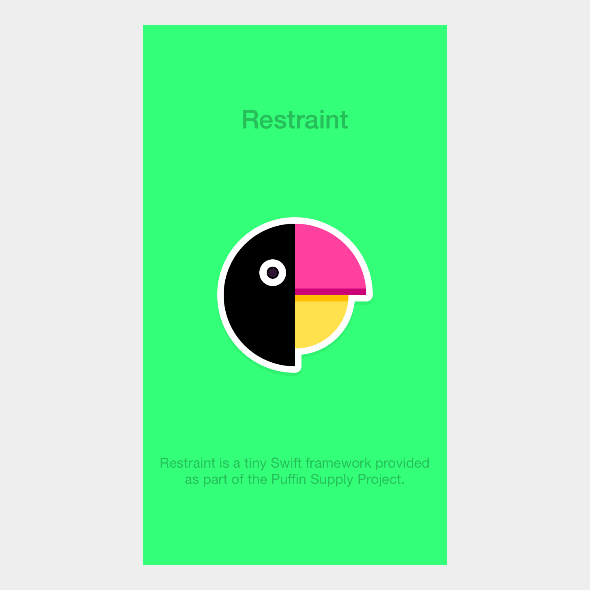

# Restraint

Restraint is a very very small library to help make your use of `NSLayoutConstraint` in Swift more legible & declarative.

- Like programmatic views?
- Like the benefits of using pure AutoLayout?
- Like clear and minimal interfaces?
- Dislike Visual Format Language and "stringly" typing?
- Dislike the verbosity of `NSLayoutConstraint`?
- Dislike heavy dependencies?
- Practice `Restraint`!


## Features

- [x] As simple as possible
- [x] Easy to maintain
- [x] Easy to replace
- [x] Easy to circumvent
- [x] Not too clever
- [x] Sane defaults
- [x] Automatic handling of `setTranslatesAutoresizingMaskIntoConstraints`

## Basic Example

Let's set the height & width of an `imageView` to `200` points and center in the current `UIView`. Here's how we would do that with `NSLayoutConstraint`:

```swift
let imageViewWidthConstraint = NSLayoutConstraint(
  item:       imageView,
  attribute:  .Height,
  relatedBy:  .Equal,
  toItem:     nil,
  attribute:  .NotAnAttribute,
  multiplier: 1.0,
  constant:   200
)

let imageViewHeightConstraint = NSLayoutConstraint(
  item:       imageView,
  attribute:  .Width,
  relatedBy:  .Equal,
  toItem:     nil,
  attribute:  .NotAnAttribute,
  multiplier: 1.0,
  constant:   200
)

imageView.addConstraints([imageViewWidthConstraint, imageViewHeightConstraint])

let imageViewHorizontalConstraint = NSLayoutConstraint(
  item:       imageView,
  attribute:  .CenterX,
  relatedBy:  .Equal,
  toItem:     self,
  attribute:  .CenterX,
  multiplier: 1.0,
  constant:   0
)

let imageViewVerticalConstraint = NSLayoutConstraint(
  item:       imageView,
  attribute:  .CenterY,
  relatedBy:  .Equal,
  toItem:     self,
  attribute:  .CenterY,
  multiplier: 1.0,
  constant:   0
)

addConstraints([imageViewHorizontalConstraint, imageViewVerticalConstraint])
```

### :fearful:

And of course, this depends upon your particular formatting conventions. You know how quickly this gets out of hand.

Here's how to apply these same constraints with `Restraint`:

```swift
Restraint(imageView, .Width,  .Equal, 200).addToView(imageView)
Restraint(imageView, .Height, .Equal, 200).addToView(imageView)

Restraint(imageView, .CenterX, .Equal, self, .CenterX).addToView(self)
Restraint(imageView, .CenterY, .Equal, self, .CenterY).addToView(self)
```

### :massage:

## Detailed Example



For this view, we'd like to:

- Center the `imageView` (which is of a fixed size) vertically and horizontally in the containing view.
- Center `topLabel` (which is of a variable size) vertically between the top of `imageView` and the top of the containing view.
- Center `topLabel` horizontally in the containing view.
- Center `bottomLabel` (which is of a variable size) vertically between the bottom of `imageView` and the bottom of the containing view.
- Set the width of `bottomLabel` to the width of the containing view less its layout margins.

Here are those rules expressed with `Restraint`:

```swift
// Image View Constraints

Restraint(imageView, .Width,  .Equal, imageViewSize).addToView(self)
Restraint(imageView, .Height, .Equal, imageViewSize).addToView(self)

Restraint(imageView, .CenterX, .Equal, self, .CenterX).addToView(self)
Restraint(imageView, .CenterY, .Equal, self, .CenterY).addToView(self)

// Top Label Constraints

Restraint(topLabel, .CenterX, .Equal, imageView, .CenterX).addToView(self)
Restraint(topLabel, .CenterY, .Equal, imageView, .Top, 0.5, 0).addToView(self)

// Bottom Label Constraints

Restraint(bottomLabel, .Left,  .Equal, self, .LeftMargin).addToView(self)
Restraint(bottomLabel, .Right, .Equal, self, .RightMargin).addToView(self)

Restraint(bottomLabel, .CenterY, .Equal, self, .CenterY, 1.5, (200 / 4)).addToView(self)
```

You can see this in action in [Example/View.swift](Example/Example/View.swift)


## How It Works

Each `Restraint` simply creates the appropriate `NSLayoutConstraint`, and the call to `addToView` disables `translatesAutoresizingMaskIntoConstraints` on the left and right views in the constraint and adds that constraint to the target view.

Optionally, you can call `Restraint().constraint()` to get an instance of `NSLayoutConstraint` and add your constraint with `UIView#addConstraint` or `#addConstraints` later. For example:

```swift
let heightConstraint = Restraint(imageView, .Height, .Equal, 200).constraint()

imageView.addConstraint(heightConstraint)
```

In this case you'll need to handle disabling `translatesAutoresizingMaskIntoConstraints` yourself.

## Installation

### Carthage

Add the following to your project's `Cartfile`:

```swift
github "puffinsupply/Restraint" >= 0.0.1
```

### Manual

Simply add [Restraint.swift](Restraint/Restraint.swift) to your project.

## License

- [MIT](http://thi.mit-license.org/)
